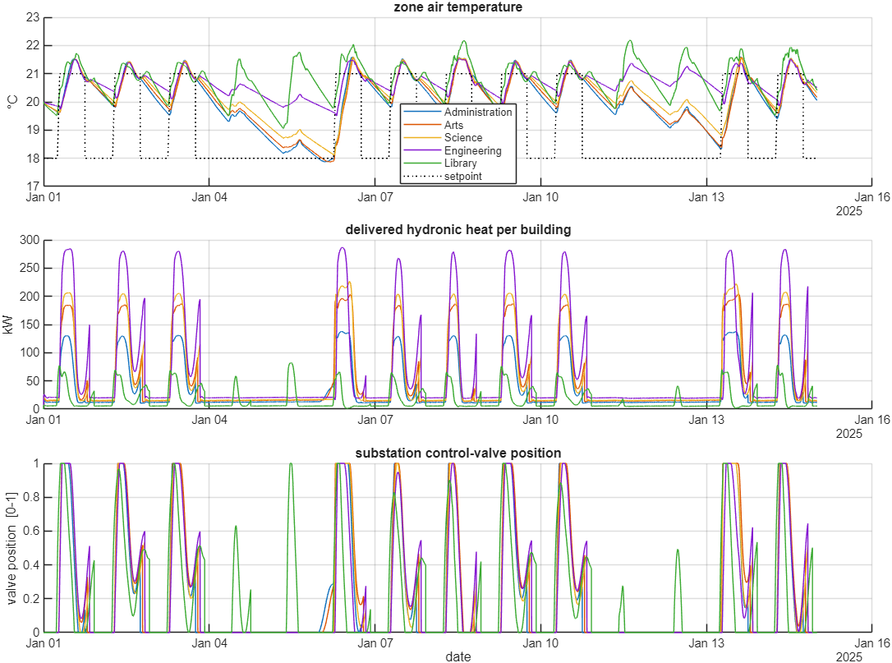

# TMSIC: Thermal Modeling for System Identification and Control

TMSIC is a MATLAB toolbox for building thermal models of buildings and district heating
systems, and for using them to identify parameters and to design controllers. It has two
parts. `RCBS` describes a building as a resistance–capacitance (RC) network. `DHS` connects
such buildings to a gas-fired heat plant through a pipe network with pumps, valves and heat
exchangers. Both are written in plain MATLAB, with no Simulink.

The models are small enough to be fitted to measured data, fast enough to simulate for weeks,
and available as linear state-space systems for controller design.


## Design: build a system by calling its API

A TMSIC model is assembled from named parts. Each part is an object, and each connection is
a method call whose name says what it does. A reader can follow the code against the diagram
without opening the documentation.

```matlab
% A building: name its elements, then couple its zones
b = RCBS.Building();  b.addStorey('S1');
b.S1.addZone('Lab');  b.S1.addZone('Corridor');
b.S1.Lab.addWall(0.02, 2e7, [], 'Wall');
b.S1.Lab.addWindow(0.01, 'Window');
b.S1.Lab.connectToZone(b.S1.Corridor, 0.02, 'Partition', 5e6);

% A district network: connect a pipe's output to the next part
pipe1 = DHS.Hydraulic.Pipe('CHP->T1', 'L',40, 'D',0.11);
chp.supplyPort.connectToPipe(pipe1);
tee1  = pipe1.addTjunction('T1', 0.05);
hn.connectBuilding(tee1, building);

% A control law: attach it to the actuator it drives
hx.valve.attachController( DHS.controllers.PID(0.14, 1.6e-4, 0) );
```

These are excerpts, so `chp`, `hn`, `building` and `hx` are assumed to exist. The
documentation pages contain complete examples together with the output they produce.

Four rules follow from this. A part owns its parameters and its live state as properties, so
you set and read them directly. A part can be replaced by another of the same kind without
touching the rest of the model, for example a centrifugal pump by a fixed-displacement pump,
or a PID by an LQR, in one line. The pipe network can be described in two equivalent styles
(a declarative one that names the two nodes of each pipe, and a port-wiring one that connects
outputs to inputs), and both reach the same solver. Finally, `RCBS` never depends on `DHS`,
so the building models can be used alone.

## What it can do

- **Model a building of any size.** Storeys, zones, walls, roofs, windows, internal mass,
  partitions and floor slabs, each added with one call. `building.visualize()` draws the
  network.
- **Export a linear model.** `getStateSpace` returns the continuous state-space system for
  controller design or parameter identification.
- **Assemble a district heating system.** A central plant with boilers and a pump, a pipe
  network with T-junctions, and buildings with a plate heat exchanger, a control valve and a
  pump. Pumps are centrifugal or fixed-displacement.
- **Swap the control law.** `PID`, `LQR` and `Relay` share one interface, and a custom law
  needs two methods.
- **Fit models to data.** Two worked examples identify RC parameters of a single zone and of
  an eight-zone building with `fmincon`.
- **Run quickly.** A five-building campus simulated for 14 days at one-minute steps (20,161
  steps) takes about 30 s on the development machine. The 30-zone version takes one to two
  minutes.
- **Trust the physics.** Eighteen component checks compare each part with a closed-form
  solution or a published correlation, and 22 unit tests cover the interfaces
  ([validation report](validation/README.md)).

## Examples

All examples are in `examples/` and run without extra data. Start with `dhs_campus`.

| Script | What it shows |
|---|---|
| `RCBS_example.m` | A three-storey, seven-zone building built by hand: walls, windows, internal mass, capacitive partitions and slabs, and two heat inputs. It simulates three days and draws the RC schematic. |
| `dhs_campus.m` | A five-building campus on one gas plant. It builds the network with the port-wiring API, runs 14 days, prints a plausibility summary and plots the plant and building signals. The assembly is in `+DHS/+examples/campus.m`. |
| `dhs_campus_multizone.m` | The same campus with 30 zones of different room types, all served by one substation per building. It prints the temperature error of every zone and shows where building-level control stops being enough. |
| `system_identification.m` | Fits a 10-parameter single-zone model (topology R5C4) to a temperature record and checks it on held-out data. On the synthetic record supplied, the validation error is 0.15 °C. |
| `multi_zone_system_identification.m` | The same procedure for an eight-zone building with 75 parameters, fitted against eight measured zone temperatures at once. |



In the campus run the plant supply temperature stays between 65.8 and 74.9 °C around a 70 °C
setpoint, the boiler efficiency ranges from 0.885 to 0.927, and the energy balance closes to
0.00 % over the two weeks.

## Getting started

TMSIC was developed and tested on MATLAB R2025b and uses functions introduced in R2020a. The
Control System Toolbox is required for `getStateSpace` and the `LQR` controller, and the
Optimization Toolbox for the two identification examples. The rest runs on base MATLAB.

```matlab
setup                              % adds the toolbox folders to the path
run('examples/dhs_campus.m')       % a first district heating simulation
runtests('tests')                  % 22 unit tests
run_all_validation                 % 18 accuracy checks and their figures
```

## Documentation

Each page describes one part of the toolbox: what it does, the equations behind it, its
inputs and outputs, and a short example that you can run.

| Page | Contents |
|---|---|
| [`docs/rcbs-building.md`](docs/rcbs-building.md) | `RCBS.Building`, `Storey`, `Zone` and `Simulation`: the RC network, its equations and the solver. |
| [`docs/dhs-system.md`](docs/dhs-system.md) | `DHS.System`: assembling and running a district heating system, and its results. |
| [`docs/dhs-hydraulic.md`](docs/dhs-hydraulic.md) | Pipes, junctions, T-junctions, both pump types and valves, with both ways of wiring a network. |
| [`docs/dhs-plant.md`](docs/dhs-plant.md) | `CentralHeatPlant` and `Boiler`: plant water dynamics and burner control. |
| [`docs/dhs-heat-exchanger.md`](docs/dhs-heat-exchanger.md) | `HeatExchanger`: heat transfer and pressure loss of a substation. |
| [`docs/dhs-building.md`](docs/dhs-building.md) | `DHS.Building`: a building on the loop, with one zone or several. |
| [`docs/dhs-controllers.md`](docs/dhs-controllers.md) | `PID`, `LQR`, `Relay` and how to write your own controller. |
| [`docs/dhs-weather-solar-schedule.md`](docs/dhs-weather-solar-schedule.md) | Weather data, solar gains and occupancy schedules. |
| [`docs/references.md`](docs/references.md) | The sources behind the equations and defaults. |
| [`validation/README.md`](validation/README.md) | The validation report, with a figure for every check. |

## Citing TMSIC

If you use TMSIC in your work, please cite:

> Darvishpour, S. and Van Heusden, K. *A MATLAB Toolbox for Thermal Modeling of Buildings and District Heating Systems for System Identification and Control (TMSIC)*, 2027

Bibtex:

```bibtex
@misc{darvishpour_tmsic,
  author = {Darvishpour, Shahin and Van Heusden, Klaske},
  title  = {A {MATLAB} Toolbox for Thermal Modeling of Buildings and District Heating Systems for System Identification and Control ({TMSIC})},
  year   = {2027}
}
```

## License

TMSIC is free software, released under the GNU General Public License, version 3. You may
use, modify and redistribute it under the terms of that license. See [`LICENSE`](LICENSE)
for the full text.
