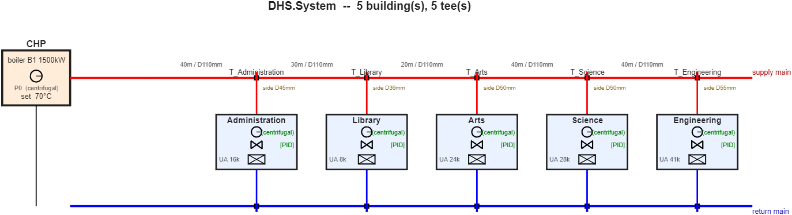

# DHS.Hydraulic: pipes, junctions, pumps and valves

The hydraulic parts of a district network live in the package `DHS.Hydraulic`: `Pipe`,
`Junction`, `TJunction`, the two pump types `CentrifugalPump` and `FixedDisplacementPump`
(both derived from the abstract `Pump`), and `Valve`. The network that joins them,
`DHS.HydraulicNetwork`, and the co-simulation loop sit one level up in `+DHS`.

The network is a tree. Its root is the plant, its branch points are junctions, and each
building hangs from one junction. Every supply junction has a return junction, called its
mirror, and every supply pipe has a return pipe of the same length and diameter. You
describe the supply side only; the return side is created for you. The plant has one
central pump, and each substation has its own pump, so the flow in one branch depends on
the flow in all the others. Opening one building's valve raises the total flow, lowers the
central pump's head and reduces the flow in every other branch (checked in
`validation/README.md`, section 2.7).



## Building a network

Two ways of describing the same network are available. The declarative style names the
two nodes a pipe joins. The port-wiring style builds a pipe, connects its input, and
connects its output, in the way `RCBS.Zone.addWall` and `connectToZone` build a zone. Both
call the same registration routine inside `DHS.HydraulicNetwork`, so the solver cannot
tell which one you used. Pick the one that reads better for the task.

The two examples below build a plant with two buildings on a trunk that has two
T-junctions. Both use this helper, which creates a building with a one-zone thermal model
and a substation. Save it as `addTestBuilding.m`.

```matlab
function b = addTestBuilding(sys, name)
    rc = RCBS.Building();  rc.addStorey('S');  rc.S.addZone('Z');
    rc.S.Z.setAir(2e7, 20);  rc.S.Z.addWindow(0.001, 'Window');
    b = sys.addBuilding(name);  b.useRCModel(rc);
    b.addHeatExchanger('HX', 'UA',8e3, 'Qcap',2e5);
    b.attachSolar(DHS.Solar());  b.attachSchedule(DHS.Schedule());
end
```

### Declarative style

```matlab
sys = DHS.System('weather','solar_data_2025.csv');
chp = sys.addCentralHeatPlant('CHP');
chp.addBoiler('B1', 'QMax',1e6);
chp.addPump('P0', 'dp0',3e5, 'mdotMax',12);
hn  = sys.addHydraulicNetwork();

t1 = hn.addJunction('T1', 'type','tee', 'mainDiameter',0.11, 'sideDiameter',0.05);
t2 = hn.addJunction('T2', 'type','tee', 'mainDiameter',0.11, 'sideDiameter',0.05);
hn.addPipe(chp.supplyPort, t1, 'L',40, 'D',0.11);
hn.addPipe(t1, t2, 'L',50, 'D',0.11);
hn.connectBuilding(t1, addTestBuilding(sys, 'North'));
hn.connectBuilding(t2, addTestBuilding(sys, 'South'));

sys.compile();
s = hn.solve(1);            % central pump at full speed
```

### Port-wiring style

```matlab
sys = DHS.System('weather','solar_data_2025.csv');
chp = sys.addCentralHeatPlant('CHP');
chp.addBoiler('B1', 'QMax',1e6);
chp.addPump('P0', 'dp0',3e5, 'mdotMax',12);
hn  = sys.addHydraulicNetwork();

pipe1 = DHS.Hydraulic.Pipe('CHP->T1', 'L',40, 'D',0.11);
chp.supplyPort.connectToPipe(pipe1);                 % plant output -> pipe1
t1 = DHS.Hydraulic.TJunction('T1', 'mainDiameter',0.11, 'sideDiameter',0.05);
pipe1.connectOutput(t1);                             % pipe1 -> tee T1

pipe2 = DHS.Hydraulic.Pipe('T1->T2', 'L',50, 'D',0.11);
t1.connectToPipe('portB', pipe2);                    % the run of T1 -> pipe2
t2 = DHS.Hydraulic.TJunction('T2', 'mainDiameter',0.11, 'sideDiameter',0.05);
pipe2.connectOutput(t2);                             % pipe2 -> tee T2

hn.connectBuilding(t1, addTestBuilding(sys, 'North'));
hn.connectBuilding(t2, addTestBuilding(sys, 'South'));

sys.compile();
s = hn.solve(1);
```

Both scripts give the same answer to the last bit:

```
s.mdot   = [4.3134  4.2964]   kg/s      (North, South)
s.Mtot   = 8.6098             kg/s
s.dpPump = 145,566            Pa
```

`pipe.addTjunction(name, sideDiameter)` is a shortcut for the two lines that create a
tee and connect a pipe to it. The tee's main diameter is the pipe's own diameter, and the
tee is returned:

```matlab
tee = pipe1.addTjunction('T1', 0.05);
```

A building's service connection is sized by `building.connLength` and `building.connD`
and is folded into the branch closure in `solve`, so the last hop to a building is always
`hn.connectBuilding(junction, building)`. When the junction is a `TJunction`, the building
takes the tee's branch leg regardless of how many other pipes already leave that tee.

### Swapping a part

A pump or a valve can be replaced after the network has been built. Here the North
substation gets a fixed-displacement pump that delivers 3 kg/s, capped at 250 kPa:

```matlab
north = sys.buildings{1};
north.heatExchanger.attachPump( ...
    DHS.Hydraulic.FixedDisplacementPump('North.pump', 'mdotRated',3, 'dpMax',2.5e5) );
sys.compile();
s = hn.solve(1);            % s.mdot = [3.0000  4.7603]
```

North now receives exactly its commanded flow, and South, which shares the trunk, adjusts.

## Physical models

### Pipe

Pressure drop follows Darcy–Weisbach with the explicit Swamee–Jain friction factor [16](references.md#r16), an approximation of the
implicit Colebrook–White equation [17](references.md#r17):

$$\Delta p = K\,\dot m^2,\qquad K = \frac{f\,L}{D\cdot 2\rho A^2},\qquad
f = \frac{0.25}{\left[\log_{10}\!\left(\dfrac{\varepsilon/D}{3.7}+\dfrac{5.74}{\mathrm{Re}^{0.9}}\right)\right]^2}.$$

The factor is clamped to the range 0.008 to 0.1, and $f = 64/\mathrm{Re}$ below
$\mathrm{Re} = 2300$. Heat loss is steady, $\dot Q = U'\,L\,(T_\text{water} - T_\text{ground})$, and
the network applies it as a transport temperature drop along the pipe.

This matches MathWorks' Simscape Pipe (TL) block [50](references.md#r50): the same
$K\dot m^2$ Darcy-Weisbach term and the same $f=64/\mathrm{Re}$ laminar law (Simscape uses
the Haaland equation rather than Swamee-Jain in the turbulent range; the two agree to within
about 2% [18](references.md#r18)). Pipes here are assumed level (no $\rho g\,\Delta z$ term)
and the network is solved quasi-statically, without fluid inertia or wave dynamics.

### T-junction

A `TJunction` adds the minor loss of a real T-fitting, using the equivalent-length method
for a standard tee: an equivalent length of 20 pipe diameters when the flow goes straight
through (the run) and 60 diameters when the flow turns into the side leg (the branch),
independent of how the flow actually splits between them:

$$K_\text{run} = f(D_\text{main})\,\frac{20\,D_\text{main}}{D_\text{main}\,2\rho A_\text{main}^2},\qquad
K_\text{branch} = f(D_\text{side})\,\frac{60\,D_\text{side}}{D_\text{side}\,2\rho A_\text{side}^2}.$$

This matches MATLAB/Simscape's own default T-Junction (TL) model [51](references.md#r51),
which cites Crane Technical Paper 410's 1981 edition [52](references.md#r52). A newer
edition [23](references.md#r23), Idelchik [24](references.md#r24) and Rennels and
Hudson [53](references.md#r53) instead give a correlation in the flow-split ratio and the
branch angle; see `validation/README.md` for the comparison.

By default (`frictionModel = 'fixed'`) $f$ is evaluated at the fully turbulent asymptote
for that leg's own diameter, matching Simscape's own $f_T$, a tabulated per-size constant.
Setting `frictionModel = 'actual'` instead evaluates $f$ at the leg's own instantaneous
flow, the same laminar/turbulent rule `Pipe.resistance` uses, for users who want more
accuracy than the fixed-$f_T$ convention gives.

The coefficient is added to the Darcy–Weisbach term of the pipe that leaves the tee by
`portB` (run) or `portC` (branch). For a 0.10 m main and a 0.05 m side leg the two
coefficients are 2.73 and 153.5 Pa/(kg/s)$^2$. The loss is applied on the supply side
only; the return-side mirror is a plain junction.

### Centrifugal pump

The head–flow curve is a parabola, and speed scaling follows the affinity laws
(Karassik et al. [25](references.md#r25); Gülich [26](references.md#r26)):

$$H(\dot m, s) = s^2\,\Delta p_0 - \Delta p_0\,\frac{\dot m^2}{\dot m_\text{max}^2}.$$

Closed onto a branch of resistance $K$ with differential pressure $\Delta p_\text{avail}$
already available at its tee, the flow is

$$\dot m = \sqrt{\frac{s^2\Delta p_0 + \Delta p_\text{avail}}{K + \Delta p_0/\dot m_\text{max}^2}}.$$

This is the special case of MATLAB/Simscape's Centrifugal Pump (TL) general affinity-law
model [54](references.md#r54) for a quadratic reference head curve.

### Fixed-displacement pump

A gear, screw or piston pump delivers a flow set by its speed almost regardless of the
pressure, until a relief valve opens (Karassik et al. [25](references.md#r25)):

$$\dot m = \min\!\left(s\,\dot m_\text{rated},\ \sqrt{\frac{\max(0,\ \Delta p_\text{max} + \Delta p_\text{avail})}{K}}\right).$$

As the central plant pump, this type reports its relief-valve pressure $\Delta p_\text{max}$
as the header head whenever it runs. A full positive-displacement solve, in which the pump
sets the flow of the whole network, is not implemented.

MATLAB/Simscape's Fixed-Displacement Pump (TL) [55](references.md#r55) models the same
pump type in more detail, with shaft torque/speed, volumetric leakage and friction torque;
this is a simpler commanded-flow-with-relief-valve model of the same physics.

### Control valve

The valve follows the IEC 60534 flow coefficient [22](references.md#r22), $Q\,[\mathrm{m^3/h}] = K_v\sqrt{\Delta p\,[\mathrm{bar}]}$,
which gives $\Delta p = K\,\dot m^2$ with $K = 10^5\cdot 3600^2/(K_v^2\rho^2)$. The
coefficient depends on the travel $\text{pos}$ through the inherent characteristic, linear
($K_v/K_{vs} = \text{pos}$) or equal-percentage ($K_v/K_{vs} = R^{\text{pos}-1}$, with
rangeability $R$, usually 25 to 50). Travel is floored at 0.02 to avoid a division by zero.

MATLAB/Simscape's Gate Valve (TL) block [58](references.md#r58) models a different valve
archetype -- a discharge coefficient and gate opening area -- rather than the $K_v$
flow-coefficient model used here.

## Function reference

### `DHS.Hydraulic.Pipe`

| Function | Inputs | Output or effect |
|---|---|---|
| `Pipe(name, 'L',L, 'D',D, 'eps',e, 'UperM',U)` | name; length (m), inner diameter (m), roughness (m, default 4.6e-5), heat-loss coefficient (W/m/K, default 0.30) | A pipe with no ends yet. `Pipe(name, nodeA, nodeB, ...)` also sets the ends. |
| `connectOutput(port)` | a junction or port | Ends the pipe at `port` and registers it with the network its input belongs to. Returns the pipe. |
| `addTjunction(name, sideDiameter)` | name; side-leg diameter (m) | Creates a `TJunction` of this pipe's diameter at its downstream end and returns it. |
| `resistance(mdot, rho, mu)` | flow (kg/s), density (kg/m³), viscosity (Pa·s) | $K$ in Pa/(kg/s)², including any tee loss. |
| `.mdot`, `.vel`, `.dp`, `.f`, `.Tdrop` | none | Live flow, velocity, pressure drop, friction factor and temperature drop, filled by `solve`. |

### `DHS.Hydraulic.Junction` and `TJunction`

| Function | Inputs | Output or effect |
|---|---|---|
| `Junction(name, side)` | name; `'supply'` or `'return'` | A hydraulic node. A supply junction creates its return mirror. |
| `connectToPipe(pipe)` | a `Pipe` | Attaches the pipe downstream of the node. Returns the pipe. |
| `TJunction(name, 'mainDiameter',Dm, 'sideDiameter',Ds)` | name; diameters (m) | A tee. `portA` is the tee itself (the inbound node). |
| `connectToPipe('portB', pipe)` | port name, pipe | Wires the run. `connectToPipe(pipe)` alone means `portB`. |
| `connectToPipe('portC', pipe)` | port name, pipe | Wires the side branch. |
| `teeLossK(side, rho, mu, mdot)` | `'run'` or `'branch'`, density, viscosity, flow (kg/s, only used when `frictionModel='actual'`) | The coefficient $K_\text{run}$ or $K_\text{branch}$ in Pa/(kg/s)². |
| `.frictionModel` | `'fixed'` (default) or `'actual'` | Whether $f$ is evaluated at the fully turbulent asymptote or at the leg's own flow. |
| `.p`, `.mdotThrough` | none | Live gauge pressure (Pa) and through flow (kg/s). |

### `DHS.Hydraulic.CentrifugalPump` and `FixedDisplacementPump`

| Function | Inputs | Output or effect |
|---|---|---|
| `CentrifugalPump(name, 'dp0',dp0, 'mdotMax',m, 'minSpeed',s)` | name; shut-off head (Pa), run-out flow (kg/s), speed floor | A centrifugal pump. |
| `FixedDisplacementPump(name, 'mdotRated',m, 'dpMax',dp, 'minSpeed',s)` | name; rated flow (kg/s), relief pressure (Pa), speed floor | A positive-displacement pump. |
| `curveHead(mdot, frac)` | total flow (kg/s), speed fraction | Head (Pa) at the plant header, the central-pump role. |
| `solveBranch(K, dpAvail, frac)` | branch resistance, available differential pressure (Pa), speed fraction | `[m, h]`: the flow and head the pump settles to on that branch, the substation-pump role. |
| `attachController(c)` | a `DHS.controllers.Controller` | Drives `.speed` from the controller at every step. |
| `.speed`, `.minSpeed` | 0 to 1 | Speed command and its floor. |
| `.head`, `.mdot` | none | Live head and flow, filled by `solve`. |

Example values for a pump with $\Delta p_0 = 300$ kPa and $\dot m_\text{max} = 14$ kg/s: the
head is 300 kPa at zero flow, 202 kPa at 8 kg/s and 94 kPa at 8 kg/s and speed 0.8. On a
branch with $K = 3000$ Pa/(kg/s)² it settles at 8.14 kg/s. A fixed-displacement pump
(5 kg/s, 300 kPa) on the same branch delivers 5.00 kg/s, and on a branch with
$K = 4\times10^5$ it is limited to 0.87 kg/s.

### `DHS.Hydraulic.Valve`

| Function | Inputs | Output or effect |
|---|---|---|
| `Valve(name, 'Kvs',Kvs, 'char',c, 'rangeability',R)` | name; rated $K_v$ (m³/h/√bar, default 25), `'eqpct'` or `'linear'`, rangeability (default 50) | A control valve. |
| `resistance(rho, pos)` | density (kg/m³), travel 0 to 1 (default `.pos`) | $K$ in Pa/(kg/s)². |
| `attachController(c)` | a `Controller` | Drives `.pos` from the controller at every step. |

For $K_{vs} = 18$ and $R = 50$ the coefficient is 4,182 Pa/(kg/s)² fully open, which is
37.6 kPa at 3 kg/s. At half travel it is 209,099 Pa/(kg/s)².

### `DHS.HydraulicNetwork`

| Function | Inputs | Output or effect |
|---|---|---|
| `addJunction(name, 'type',t, 'mainDiameter',Dm, 'sideDiameter',Ds)` | name; `'plain'` (default) or `'tee'`; diameters (m) | A supply junction. |
| `addPipe(nodeA, nodeB, 'L',L, 'D',D, ...)` | two nodes (junctions or `chp.supplyPort`); pipe properties | Registers a supply pipe and its return mirror. Returns the pipe. |
| `connectBuilding(junction, building)` | a supply junction, a `DHS.Building` | Hangs the building from the junction. |
| `compile()` | none | Freezes the topology into index arrays. `solve` calls it when needed. |
| `solve(pumpFrac)` | central pump speed, 0 to 1 (default 1) | A structure with `Mtot` (kg/s), `dpPump` and `pSupHeader` (Pa), and per building `mdot`, `vel`, `pSupBranch`, `pRetBranch`. |
| `.rho`, `.mu`, `.pReturnRef` | scalars | Density (978 kg/m³), viscosity (4.0e-4 Pa·s) and the return-side reference gauge pressure (1.5e5 Pa). |
| `.junctions`, `.pipes`, `.retPipes`, `.buildings` | none | The registered parts, as cell arrays. |

The solver walks the tree from the plant, computes each segment's flow from the branch
flows below it, subtracts $K\,\dot m^2$ along every pipe, closes each building branch
through its own pump's `solveBranch`, and repeats with damping until the total flow
converges. Its accuracy is checked against closed-form solutions in
[`../validation/README.md`](../validation/README.md).
