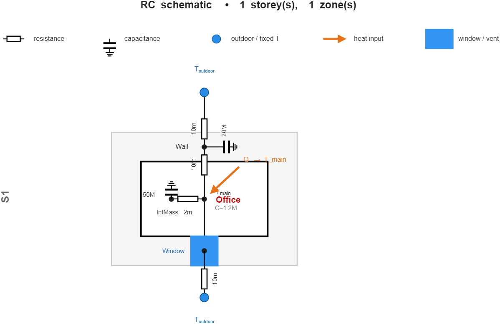

# RCBS: resistance-capacitance models of buildings

RCBS describes a building as a network of thermal resistances and capacitances. A
building contains storeys, a storey contains zones, and a zone holds temperature nodes,
resistors and heat sources. You add one element at a time (a wall, a window, a block of
internal mass) and RCBS assembles the network, integrates it in time and, when a
controller or an identification routine needs it, exports it as a continuous linear
state-space model. It does not depend on the district heating code in `+DHS`.



## Model

For a network of $N$ nodes with temperatures $T_i$ and heat capacities $C_i$, let $g_{ij}
= 1/R_{ij}$ be the conductance between nodes $i$ and $j$ and $g_{i,\text{out}}$ the
conductance from node $i$ to the outdoor boundary. For node $i$ the energy balance is

$$C_i\,\dot T_i = \sum_{j \ne i} g_{ij}(T_j - T_i) + g_{i,\text{out}}(T_{\text{out}} - T_i) + Q_i ,$$

where $Q_i$ is the heat injected at the node. Stacking the nodes, with
$\mathbf C = \mathrm{diag}(C_i)$, the conductance matrix $\mathbf L$ and the outdoor
coupling vector $\mathbf g_{\text{out}}$, gives

$$\mathbf C\,\dot{\mathbf x} = -\mathbf L\,\mathbf x + \mathbf g_{\text{out}}\,T_{\text{out}} + \mathbf q .$$

This is the linear model that `getStateSpace` returns:

$$\dot{\mathbf x} = \mathbf A\,\mathbf x + \mathbf B\,\mathbf u,\qquad
\mathbf A = -\mathbf C^{-1}\mathbf L,\qquad
\mathbf B = \mathbf C^{-1}[\,\mathbf g_{\text{out}}\ \ \mathbf I_N\,],\qquad
\mathbf u = [\,T_{\text{out}};\,Q_1;\,\dots;\,Q_N\,].$$

**Elements.** A wall or roof of total resistance $R$ and lumped capacity $C$ is a
three-resistor, two-capacitor T-network in the sense of EN ISO 13790 and EN ISO 52016-1.
Its mass sits on one internal node, joined to the zone air by $R/2$ and to the outdoor
boundary by $R/2$. A window is a single conductance from the air node to the outdoor
boundary and has no state. Internal mass is one node tied to the air node by a
resistance. `connectToZone` places a plain conductance between two air nodes (an open
doorway) or, if a mid-node capacity is given, a capacitive $R/2$–$C$–$R/2$ element (a
partition wall on one storey, or a floor slab between storeys).

**Time stepping.** The default solver is implicit (backward) Euler,

$$\left(\tfrac{1}{\Delta t}\mathbf C + \mathbf L\right)\mathbf x_{k+1} = \tfrac{1}{\Delta t}\mathbf C\,\mathbf x_k + \mathbf g_{\text{out}}\,T_{\text{out},k} + \mathbf q_k .$$

Because the left-hand matrix is constant, sparse and symmetric positive definite, it is
factorised once and every step costs one back-substitution. Backward Euler is
unconditionally stable and first-order accurate (see `validation/README.md`). Setting
`simulation.solverMode = "exact"` switches to the exact zero-order-hold discretisation
$\mathbf x_{k+1} = e^{\mathbf A\Delta t}\mathbf x_k + \mathbf B_d \mathbf u_k$.

Units are degC for temperature, W for heat, K/W for resistance, J/K for capacity and
W/K for conductance.

## Example: one zone

This zone has a 1.2 MJ/K air node, an exterior wall, a window and a block of
internal mass. A heater delivers 3 kW between 08:00 and 18:00.

```matlab
b = RCBS.Building();
b.addStorey('S1');
b.S1.addZone('Office');
b.S1.Office.setAir(1.2e6, 20);                        % C_air [J/K], T0 [degC]
b.S1.Office.addWall(0.02, 2.0e7, [], 'Wall');         % R [K/W], C [J/K], T0 (empty = air T0)
b.S1.Office.addWindow(0.01, 'Window');                % R [K/W]
b.S1.Office.addInternalMass(0.002, 5.0e7, [], 'IntMass');
b.S1.Office.connectToExternalSource( ...
    @(bb) 3000*(hour(bb.simulation.t) >= 8 && hour(bb.simulation.t) < 18), 'T_main');

b.outdoorTempFunc      = @(t) 4 + 8*sin(2*pi*(hour(t) - 8)/24);
b.simulation.startDate = datetime(2025,1,1);
b.simulation.timeStep  = minutes(15);

b.simulate(days(3));
T = b.simulation.results.S1.Office.T;                 % zone air temperature, one value per step
b.visualize();                                        % draws the schematic above
```

Over the three days the air temperature falls from 20.0 to 14.1 degC, with a daytime
maximum of 22.4 degC. Results are stored in a structure with `Time` (a `datetime` vector), `Tall`
(every node, one column each, in the order of `nodeNames`), `OutdoorTemperature`, and one
sub-structure per zone (`results.S1.Office.T`, `.heatInput`).

The state-space model for the same building has three states (air, wall, internal mass)
and four inputs (outdoor temperature and one heat input per node):

```matlab
[sysc, io] = b.simulation.getStateSpace();
size(sysc.A)             % 3 x 3
io.inputNames            % {'T_outdoor','Q_S1.Office.T_main','Q_S1.Office.Wall','Q_S1.Office.IntMass'}
```

## Example: two zones coupled by a partition

A laboratory heated with 1.5 kW shares a capacitive partition with an unheated corridor.
The outdoor temperature is held at 0 degC.

```matlab
b = RCBS.Building();
b.addStorey('S1');
b.S1.addZone('Lab');       b.S1.Lab.setAir(1.0e6, 20);
b.S1.addZone('Corridor');  b.S1.Corridor.setAir(0.6e6, 20);
b.S1.Lab.addWindow(0.01, 'Window');                   % 100 W/K to outdoors
b.S1.Corridor.addWindow(0.02, 'Window');              %  50 W/K to outdoors
b.S1.Lab.connectToZone(b.S1.Corridor, 0.02, 'Partition', 5e6);   % R_total, name, C_mid
b.S1.Lab.connectToExternalSource(@(bb) 1500, 'T_main');

b.outdoorTempFunc      = @(t) 0;
b.simulation.startDate = datetime(2025,1,1);
b.simulation.timeStep  = minutes(5);
b.simulate(days(8));
T = b.getAllZoneTemps();      % containers.Map: 'S1.Lab' -> 12.000, 'S1.Corridor' -> 6.000
```

A hand calculation gives the steady state. Since the partition conducts 50 W/K, the corridor
node satisfies $50(T_L - T_C) = 50\,T_C$, which gives $T_C = T_L/2$. Balancing the laboratory,
$1500 = 100\,T_L + 50(T_L - T_C)$, then gives $T_L = 12$ degC and $T_C = 6$ degC. After
eight days, once the partition mass has settled, the simulated values agree to three
decimals.

## Function reference

### `RCBS.Building`

| Function | Inputs | Output or effect |
|---|---|---|
| `RCBS.Building()` | none | An empty building with a 10 degC outdoor boundary. |
| `addStorey(name)` | `name`: valid MATLAB identifier | Adds a storey, reachable as `building.(name)`. |
| `simulate(duration)` | `duration`: a `duration`, or five numbers `(y,mo,d,h,min)` | Runs the model and writes `simulation.results`. `simulation.startDate` and `simulation.timeStep` must be set first. |
| `visualize()` | none | Draws the RC network: rooms, envelope T-networks, windows, internal mass, boundary terminals, heat inputs and inter-zone couplings. |
| `getAllZoneTemps()` | none | `containers.Map` from `"Storey.Zone"` to the current air temperature (degC). |
| `.outdoorTempFunc` | `@(t)` returning degC for a `datetime` | Outdoor boundary condition. |
| `.simulation` | none | The owned `RCBS.Simulation`. |

### `RCBS.Storey`

| Function | Inputs | Output or effect |
|---|---|---|
| `addZone(name, 'C_main', C)` | `name`; optional air capacity `C` (J/K) | Adds a zone, reachable as `storey.(name)`. |

### `RCBS.Zone`

| Function | Inputs | Output or effect |
|---|---|---|
| `setAir(C_air, T0)` | capacity (J/K), initial temperature (degC, optional) | Sets the air node. |
| `addWall(R, C, T0, name)` | total resistance (K/W), mass (J/K), initial temperature (degC, `[]` for the air value), name | Adds a 3R2C wall. |
| `addRoof(R, C, T0, name)` | as `addWall` | Adds a 3R2C roof. |
| `addWindow(R, name)` | resistance (K/W), name | Adds an air-to-outdoor conductance with no state. |
| `addInternalMass(R, C, T0, name)` | resistance to air (K/W), mass (J/K), initial temperature, name | Adds a mass node tied to the air node. |
| `addNode(name, C, T0)` | name, capacity, initial temperature | Adds a bare node. Wire it with your own resistors. |
| `connectToZone(other, R, name, C_mid, T0, kind)` | other zone; total resistance (K/W); name; optional mid capacity (J/K), initial temperature, and drawing hint `'wall'`, `'slab'` or `'air'` | Plain conductance if `C_mid` is omitted, capacitive partition or slab otherwise. The mid node lives in the calling zone. `kind` affects the drawing only. |
| `connectToExternalSource(hf, nodeName)` | `hf(building)` returning watts; node name (default `'T_main'`) | Injects `hf` at the node at every step. |
| `getNodeTemp(name)`, `setNodeTemp(name, T)` | node name, (temperature) | Reads or writes the live node temperature. |
| `getMainTemp()` | none | Air-node temperature (degC). |

### `RCBS.Simulation`

| Function | Inputs | Output or effect |
|---|---|---|
| `.startDate`, `.timeStep` | `datetime`, `duration` | Clock of the run. |
| `run(totalSeconds)` | seconds | Advances the model and fills `results`. `Building.simulate` calls it. |
| `stepOnce(t, Tout, Q)` | step start (`datetime`), outdoor temperature (degC), heat per node (W) as an N-vector, a struct or a `containers.Map` | Advances exactly one step and returns the new node temperatures. Used for co-simulation. |
| `getStateSpace()` | none | `[sysc, io]`: a continuous `ss` model and a structure with `stateNames`, `inputNames`, `outputNames` and `zoneMainRows`. Requires the Control System Toolbox. |
| `measure(zoneKey, nodeName)` | zone key, node | Live node temperature during a run. |
| `plotResults()` | none | Quick plot of the stored temperatures. |
| `.controlFcn`, `.stepCallback` | `f(sim)`, `f(sim,k,t,T)` | Hooks called before and after each step, for closed-loop studies or logging. |
| `.solverMode` | `"cached"` (default), `"legacy"`, `"exact"` | Backward Euler with a cached factorisation, the same scheme with a dense solve per step (a reference), or exact zero-order hold. |

References for the element models and the time discretisation are listed in
[`references.md`](references.md). The accuracy checks are in
[`../validation/README.md`](../validation/README.md).
