# Model validation report

This report documents how accurately each physical component of the toolbox reproduces a
known answer. Every component is driven with a scenario whose result is available from an
independent source: a textbook closed-form solution, a published correlation, a separate
numerical solver, or an exact conservation law. That answer is then compared with the component's output.

The `tests/` folder has a different purpose. It checks that the code runs and that its
interfaces behave, which is regression testing. Here, the checks address the physics and the mathematics.

## Reproducing the results

```matlab
addpath(genpath(pwd))
run_all_validation            % runs all 18 checks, prints a table for each, saves the figures
V = validate_pump;            % runs one check and shows its figure
V = validate_pump('none');    % runs one check without a figure
```

Each check prints a table of cases and passes only if every case is within its tolerance:

```
absolute check:  |measured - expected|                  <= tolerance
relative check:  |measured - expected| / |expected|      <= tolerance
```

The tolerances follow the known accuracy of the method being tested. For example, the
Swamee–Jain friction factor is an approximation with a published error of up to 2.04 percent
over its own validated range [18](../docs/references.md#r18); this check's own worst case (3.1 percent, at a Reynolds
number below that validated range) sets its tolerance at 3.5 percent. No tolerance was
widened to make a check pass.

**All 18 checks pass.**

## How to read the figures

Each figure shows two things and nothing else. The expected value from the reference is a
thick dashed grey line, or a grey bar. The component's output is drawn over it in colour.
Where the two agree, the coloured line covers the grey one.

| Check | Component | Largest deviation from the reference |
|---|---|---|
| [1.1](#11-single-zone-rc-model) | Single-zone RC model | 0.6 % in time constant |
| [1.2](#12-multi-layer-wall) | Wall T-network | 0.0003 °C |
| [1.3](#13-two-zones-coupled-through-a-partition-or-slab) | Coupled zones | 0.003 °C |
| [1.4](#14-time-stepping-solver) | Backward-Euler solver | 0.0002 °C against the exact discretisation |
| [1.5](#15-whole-building) | Whole building | 4e-13 in the energy balance |
| [2.1](#21-substation-heat-exchanger) | Heat exchanger | 2e-9 relative |
| [2.2](#22-centrifugal-pump) | Centrifugal pump | 6e-16 relative |
| [2.3](#23-fixed-displacement-pump) | Fixed-displacement pump | 1e-16 relative |
| [2.4](#24-control-valve) | Control valve | 3e-16 relative |
| [2.5](#25-pipe-friction) | Pipe friction | 3.1 % against Colebrook–White |
| [2.6](#26-t-junction) | T-junction | 5e-12 relative |
| [2.7](#27-pipe-network) | Pipe network | 4e-11 relative |
| [3.1](#31-pid-controller) | PID controller | 0.007 in normalised output |
| [3.2](#32-lqr-controller) | LQR controller | 0.002 in gain |
| [4.1](#41-central-heat-plant) | Central heat plant | 0.3 % in normalised temperature |
| [4.2](#42-solar-irradiance) | Solar transposition | 4e-10 relative |
| [4.3](#43-occupancy-and-setpoint-schedule) | Schedule | exact |
| [5.1](#51-building-in-a-closed-loop-system) | Building in a closed loop | 1e-3 in the heat balance |

---

## 1. Building thermal model (`+RCBS`)

### 1.1 Single-zone RC model

`validate_rc_zone`

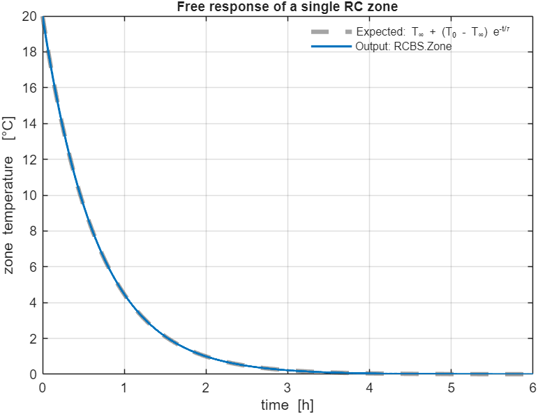

**What it validates.** The single-zone resistance–capacitance (1R1C) model: its free
temperature response, its time constant, its steady state under a constant heat input, and
the order of accuracy of its solver.

**Reference.** The lumped-capacitance solution of Incropera and DeWitt [12](../docs/references.md#r12) (Sections 5.1 to 5.3)
and EN ISO 13790:2008 [1](../docs/references.md#r1).

**Expected output.** The zone temperature decays exponentially, $T(t) = T_\infty + (T_0 - T_\infty)e^{-t/RC}$.
The time constant recovered from the simulated curve equals $RC$ to within the solver's
discretisation error. Under a constant heat input the temperature settles at $T_\text{out} + QR$.
Halving the time step halves the error, which is first-order behaviour.

**Component output.** The free-response error is 0.046 °C with a 30 s step and 0.008 °C
with a 5 s step. A time constant of 2415 s is recovered against an expected 2400 s (0.6 % higher). Steady-state temperature agrees to 2e-13 °C, and the convergence order measures 1.06.

### 1.2 Multi-layer wall

`validate_wall_tnetwork`

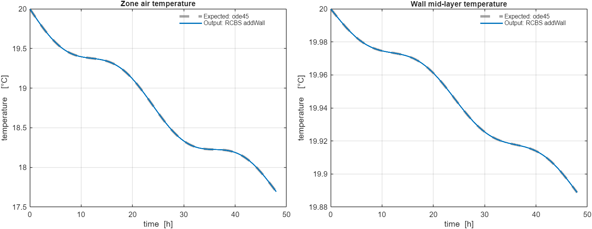

**What it validates.** The two-resistor, one-capacitor (2R1C) network that represents a
wall.

**Reference.** A numerical solution of the same equations by MATLAB's `ode45` with a
relative tolerance of 1e-10. The element model follows EN ISO 13790 [1](../docs/references.md#r1), EN ISO
52016-1 [2](../docs/references.md#r2) and Bacher and Madsen [3](../docs/references.md#r3).

**Expected output.** Over a two-day run, the zone air temperature and the wall mid-layer
temperature follow the `ode45` solution. The amplitude of the day–night temperature swing
matches it as well.

**Component output.** The largest deviation is 0.00034 °C for the air and 0.000016 °C for
the wall. Steady-periodic amplitude is 0.542245 °C against 0.542263 °C.

### 1.3 Two zones coupled through a partition or slab

`validate_interzone_slab`

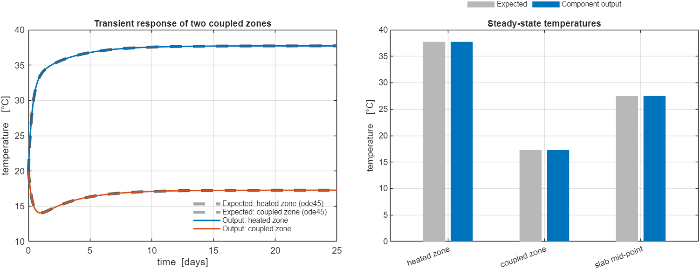

**What it validates.** Two zones exchanging heat through a capacitive partition wall or
floor slab.

**Reference.** An `ode45` solution for the transient and the closed-form steady state of
the same resistor network (ASHRAE *Handbook: Fundamentals* [7](../docs/references.md#r7)).

**Expected output.** The simulated transient follows `ode45`. At steady state the heated
zone is at 37.727 °C and the coupled zone at 17.273 °C, and the slab mid-point sits at the
average of the two.

**Component output.** The largest transient deviation is 0.0027 °C. At steady state the zones reach 37.726 °C and 17.272 °C, and the slab mid-point reaches 27.498 °C against 27.499 °C expected.

### 1.4 Time-stepping solver

`validate_bdf_solver`

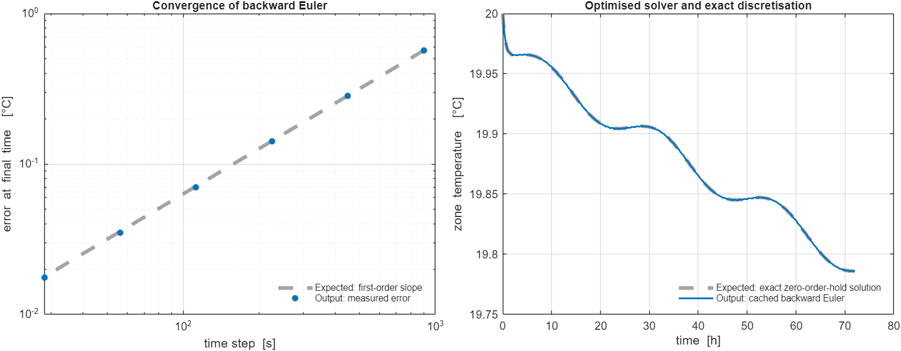

**What it validates.** The backward-Euler integrator shared by every RC model, including its
cached sparse factorisation.

**Reference.** The convergence theory of backward Euler, a plain dense solve that
serves as reference implementation, and the exact zero-order-hold discretisation (Franklin,
Powell and Emami-Naeini [41](../docs/references.md#r41)).

**Expected output.** Halving the step halves the error (order 1). The cached solver
matches the dense reference to numerical precision and differs from the exact discretisation
by no more than the method's own truncation error. The discrete energy balance closes to
machine precision.

**Component output.** The measured order is 1.005. Cached and dense solvers differ by 1.6e-12 °C. Against the exact discretisation the cached solver differs by 0.00019 °C. Its energy-balance residual is 5.5e-15.

### 1.5 Whole building

`validate_building_energy_balance`

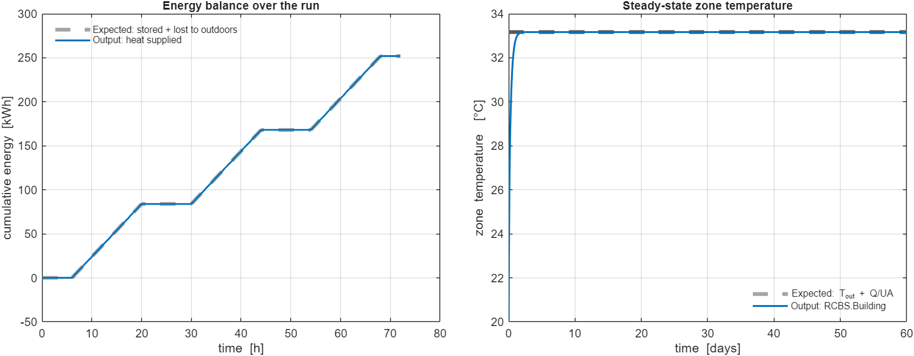

**What it validates.** A complete `RCBS.Building` with walls, windows, internal mass and
several zones: conservation of energy, and the overall heat-loss conductance.

**Reference.** The first law of thermodynamics, which a constant-coefficient RC network
satisfies exactly, and the whole-building conductance $UA = \sum 1/R$ (EN ISO 13790 [1](../docs/references.md#r1); ASHRAE
*Handbook: Fundamentals* [7](../docs/references.md#r7)).

**Expected output.** The heat supplied equals the heat stored plus the heat lost to the
outdoors, at every time. At steady state, $Q/(T_\text{zone} - T_\text{out})$ equals the sum
of the component conductances.

**Component output.** The energy-balance residual is 3.1e-14 for a single zone and 3.9e-13
for a 2×2 multi-zone layout. Measured conductance is 128.333 W/K against an analytical 128.333 W/K.

---

## 2. District heating network (`+DHS`, `+DHS/+Hydraulic`)

### 2.1 Substation heat exchanger

`validate_heat_exchanger`

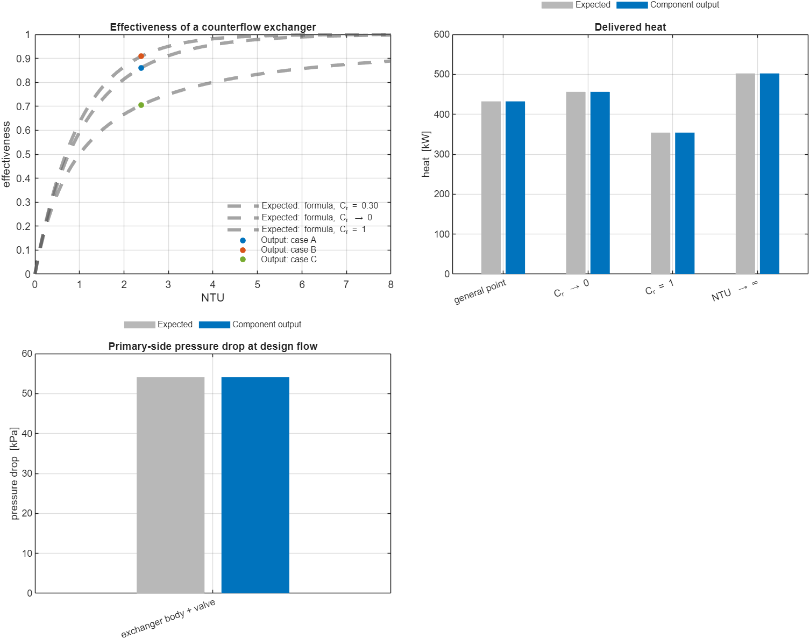

**What it validates.** The plate heat exchanger at each substation, in two respects: the heat
it transfers, and the pressure drop it and its valve add to the network branch.

**Reference.** The effectiveness–NTU relation for a counterflow exchanger (Incropera and
DeWitt [12](../docs/references.md#r12), Section 11.4), the IEC 60534 valve equation [22](../docs/references.md#r22), and the primary-side design
pressure guidance (below 20 kPa for the exchanger, 50 to 60 kPa for the whole substation)
in the IEA District Heating and Cooling connection handbook [29](../docs/references.md#r29).

**Expected output.** The delivered heat equals the closed-form value at a general operating
point and in three limits: a very large secondary flow, equal capacity rates, and a very
large heat-transfer area. The heat given up by the primary side equals the heat received by
the secondary side. The delivered heat never exceeds the rated capacity and never reverses.
The primary pressure drop equals the design body loss plus the valve loss computed
independently, and the default design drop is of the same order as the published guidance.

**Component output.** All heat-transfer cases agree with their closed forms to 2e-9 or
better: 432.3 kW at the general point, 456.2 kW, 354.1 kW and 502.3 kW in the three limits.
Energy is conserved to 3e-16. Primary pressure drop is 54.1 kPa, equal to the
independent calculation to 1e-16, and the default design drop is 30 kPa.

**Cross-check.** MathWorks' Simscape Heat Exchanger (TL-TL) and Plate Heat Exchanger
(TL-TL) blocks [56](../docs/references.md#r56), [57](../docs/references.md#r57) use the
same effectiveness-NTU relation, and the same fixed $K=\Delta p_\text{nom}/\dot m_\text{nom}^2$
pressure-loss form as their own "Pressure loss coefficient" option.

### 2.2 Centrifugal pump

`validate_pump`

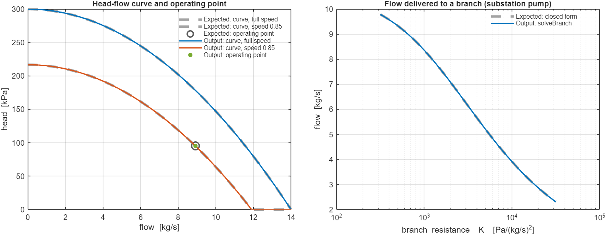

**What it validates.** The variable-speed centrifugal pump: its head–flow curve, its
speed scaling, and the flow it settles to against a resistance, both at the plant header
and on a substation branch.

**Reference.** Karassik et al. [25](../docs/references.md#r25) and Gülich [26](../docs/references.md#r26) for the affinity laws.

**Expected output.** The head is the rated shut-off value at zero flow and zero at the
run-out flow. At speed $s$ the curve obeys $H(sQ, s) = s^2 H(Q, 1)$. Against a quadratic
system curve the pump settles at the analytic intersection. On a branch of given
resistance, the flow follows the closed-form expression, and the pump's own head at that
flow equals the pressure the branch needs.

**Component output.** The shut-off head (300 kPa) and the run-out flow (14 kg/s) are exact.
Affinity scaling holds to 2e-16, and the operating point (8.909 kg/s) matches the analytic
intersection to 2e-16. Branch flow and head balance agree to 6e-16.

**Cross-check.** This quadratic curve is the special case of MathWorks' Simscape
Centrifugal Pump (TL) general affinity-law model [54](../docs/references.md#r54) for a
quadratic reference head curve.

### 2.3 Fixed-displacement pump

`validate_fixed_displacement_pump`

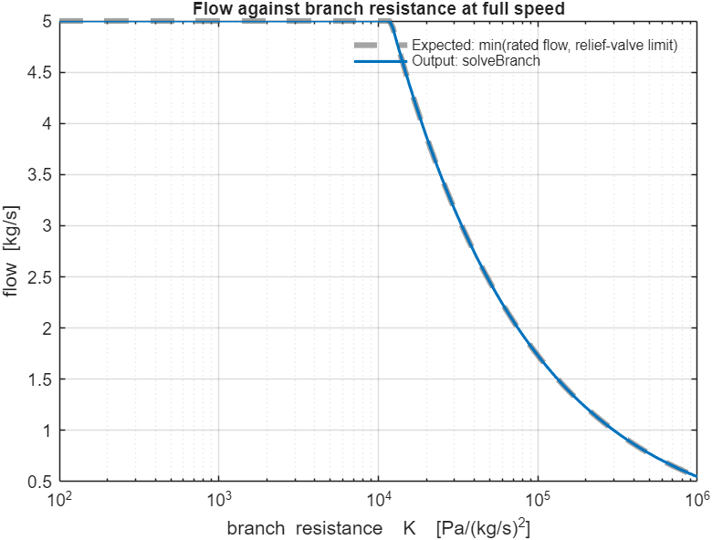

**What it validates.** The gear, screw or piston pump. Unlike a centrifugal pump, it
delivers a flow set by its speed almost regardless of pressure, until a relief valve opens.

**Reference.** Karassik et al. [25](../docs/references.md#r25) (Chapter 1): constant flow regardless of system pressure, and the
relief valve required to cap pressure.

**Expected output.** Against a low resistance the flow equals the commanded rate. Against a
high resistance the relief valve holds the pressure at its limit and the flow falls to
$\sqrt{(\Delta p_\text{max} + \Delta p_\text{avail})/K}$. The two regimes meet without a jump
at the resistance $K^* = \Delta p_\text{max}/\dot m_\text{rated}^2$. Flow is proportional to
speed while the pump is unsaturated and is bounded below by the speed floor.

**Component output.** The unsaturated flow is exactly 5 kg/s. At $K = 4\times10^5$ the flow
is 0.866 kg/s and the head is pinned at 300 kPa, matching the closed form to 1e-16. Flow is continuous across the transition at $K^* = 12{,}000$ (changing $K$ by 4 % across it
moves the flow by 0.99 % of the rated value). Speed scaling and the speed floor are exact.

**Cross-check.** MathWorks' Simscape Fixed-Displacement Pump (TL) block
[55](../docs/references.md#r55) models the same pump type with shaft torque/speed,
volumetric leakage and friction torque; this is a simpler model of the same physics.

### 2.4 Control valve

`validate_valve`

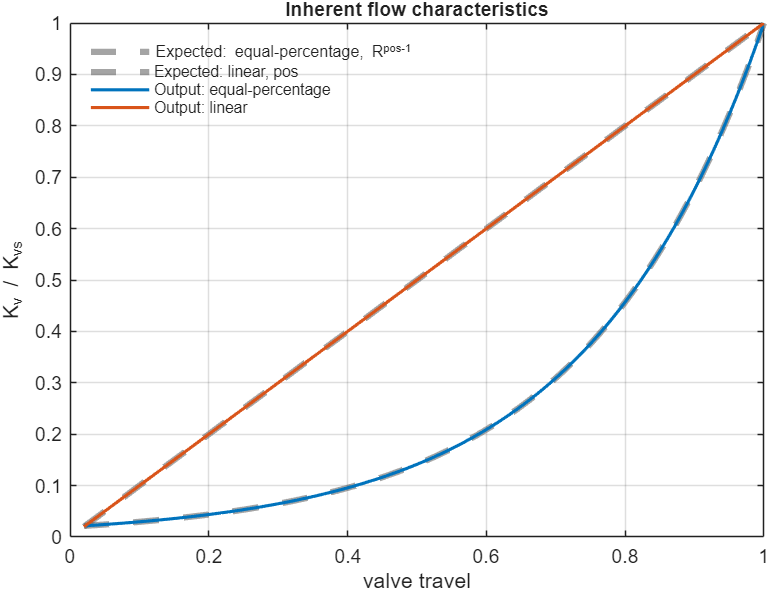

**What it validates.** The valve that regulates flow into each building: its flow-coefficient
equation and its linear and equal-percentage travel characteristics.

**Reference.** IEC 60534-2-1 [22](../docs/references.md#r22) for the flow coefficient $K_v$, and IEC
60534-2-4 (same entry) for the inherent characteristics.

**Expected output.** The rated $K_v$ can be recovered from the valve's own pressure-drop
equation. The equal-percentage characteristic follows $K_v/K_{vs} = R^{\text{pos}-1}$ and the
linear one follows $K_v/K_{vs} = \text{pos}$. A valve installed in series with a fixed
resistance has a monotonic characteristic that is closer to linear than the inherent one.

**Component output.** The recovered $K_v$ is 25.0, equal to the rated value to 3e-16. At half
travel the equal-percentage ratio is 0.141421, the exact value for $R = 50$. Agreement on the linear curve is 2e-16. With an authority of 0.59 the installed curve is monotonic and less
curved than the inherent one.

**Cross-check.** MathWorks' Simscape Gate Valve (TL) block [58](../docs/references.md#r58)
models a different valve archetype (a discharge coefficient and gate opening area) than
the $K_v$ flow-coefficient model checked here, so no direct equation match is expected.

### 2.5 Pipe friction

`validate_pipe_friction`

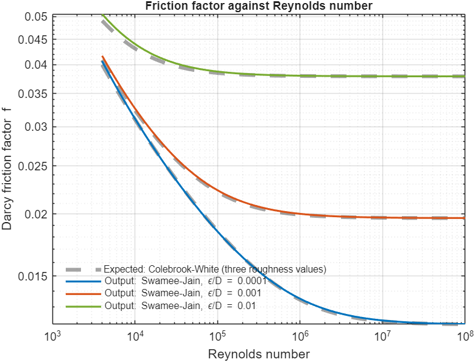

**What it validates.** The pressure loss of a pipe, which depends on the friction factor. The
toolbox uses the explicit Swamee–Jain formula.

**Reference.** The implicit Colebrook–White equation (Colebrook [17](../docs/references.md#r17)), solved here by
Newton iteration; Swamee and Jain [16](../docs/references.md#r16), whose own paper claims errors within 1 percent over
5e3 ≤ Re ≤ 1e8 and 1e-6 ≤ ε/D ≤ 1e-2; Brkić [18](../docs/references.md#r18), whose independent review reports up to 2.04 percent
for this formula; and a tabulated reference point.

**Expected output.** Over its own validated Reynolds-number range the explicit formula stays
within about 2 percent of Colebrook–White. It matches the tabulated value at $\mathrm{Re} = 10^5$ and
$\varepsilon/D = 10^{-3}$. Below the transition it reduces to $f = 64/\mathrm{Re}$. The
resistance computed by the pipe equals the Darcy–Weisbach pressure drop.

**Component output.** The largest deviation from Colebrook–White is 3.1 %, near
$\mathrm{Re} = 4\times10^3$ -- below Swamee-Jain's own stated validity floor of $\mathrm{Re}=5\times10^3$, where a larger deviation than its own claimed
accuracy is expected. At the tabulated point the formula gives 0.02234 against 0.0222 (0.6 %). Laminar values are exact, and resistance agrees with Darcy–Weisbach to 4e-16.

**Cross-check.** MathWorks' Simscape Pipe (TL) block [50](../docs/references.md#r50) uses the
same Darcy-Weisbach form and the same $f=64/\mathrm{Re}$ laminar law, but the Haaland
equation for the turbulent friction factor; Haaland and Swamee-Jain agree to within about
2 % over $10^4\le\mathrm{Re}\le10^7$ and $10^{-5}\le\varepsilon/D\le10^{-3}$.

### 2.6 T-junction

`validate_tjunction`

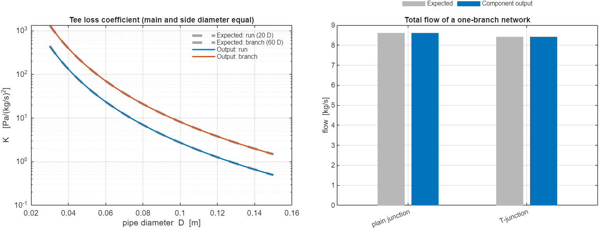

**What it validates.** The pressure loss of a T-fitting where a service pipe leaves the main
pipe, in both its `frictionModel` modes.

**Reference.** The equivalent-length method for a standard tee (20 diameters as a run, 60
diameters as a branch, independent of how flow actually splits between them). This is also
MATLAB/Simscape's own default T-Junction (TL) model [51](../docs/references.md#r51): its
"Crane correlation" option is exactly $K_\text{main}=20f_{T,\text{main}}$,
$K_\text{side}=60f_{T,\text{side}}$, citing Crane Technical Paper 410's 1981 edition
[52](../docs/references.md#r52). A newer edition [23](../docs/references.md#r23), Idelchik
[24](../docs/references.md#r24) and Rennels and Hudson [53](../docs/references.md#r53)
instead give a correlation in the flow-split ratio and the branch angle, which this check
does not test.

**Expected output.** The run and branch coefficients equal the equivalent-length
expressions. In the default `'fixed'` mode, the friction factor is evaluated at the fully
turbulent asymptote for that leg's diameter (matching Simscape's own tabulated $f_T$),
independent of the leg's actual flow. In `'actual'` mode, it instead matches a hand-built
expression evaluated at the leg's own Reynolds number, and differs from the `'fixed'`
value at low flow. At equal diameters the branch coefficient is exactly three times the run
coefficient, since 60 / 20 = 3. A pipe leaving the tee picks up the loss of the port it is
wired to, and a pipe with no tee picks up none. In a network, a tee lowers the flow by the
amount the loss predicts, and the declarative and port-wiring styles give the same loss.

**Component output.** For a 0.10 m main and a 0.05 m side leg, $K_\text{run}$ is 2.731 and
$K_\text{branch}$ is 153.53 Pa/(kg/s)², both equal to the formula. At equal diameters the
ratio is 3 to 1e-16, and the fixed-mode loss a pipe picks up is identical to 1e-12 at a
representative flow and at a deliberately tiny flow. The actual-mode coefficient matches
its Reynolds-dependent formula to 1e-9 and differs measurably from the fixed-mode value at
low flow. In a one-branch network, the total flow is 8.614 kg/s through a plain junction
and 8.423 kg/s through the tee. That second value matches the analytic prediction to 5e-12.

### 2.7 Pipe network

`validate_hydraulic_network`

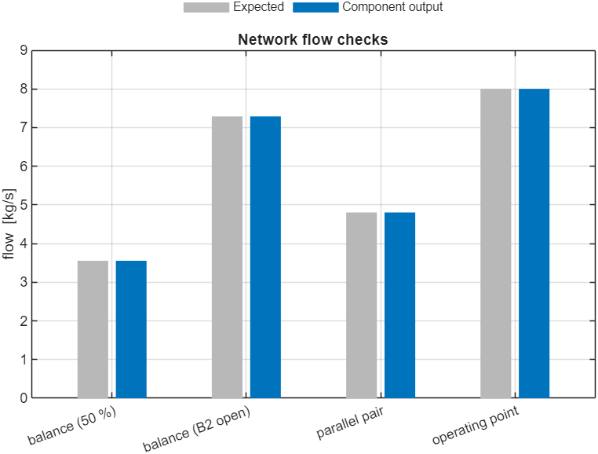

**What it validates.** The tree-structured solver that computes flow and pressure at every
point of the network, including the interaction between buildings.

**Reference.** Conservation of mass at every junction (the hydraulic counterpart of
Kirchhoff's current law) and the pressure–flow relation of each pipe. The method follows
Todini and Pilati [19](../docs/references.md#r19), the basis of EPANET [20](../docs/references.md#r20), and Larock, Jeppson and Watters [21](../docs/references.md#r21).

**Expected output.** The flow into each junction equals the flow out. Two identical parallel
branches carry equal flow. A single branch settles at the intersection of the pump curve and
the network resistance, which has a closed form. Opening one building's valve reduces the
flow in every other building, because they share the pump.

**Component output.** Mass balance closes exactly at every junction and pipe segment. Two
identical branches carry identical flow. A single branch carries 8.003 kg/s against an
analytic 8.003 kg/s (4e-11 relative). Opening one valve reduces the flow in every other
branch.

---

## 3. Control (`+DHS/+controllers`)

### 3.1 PID controller

`validate_pid`

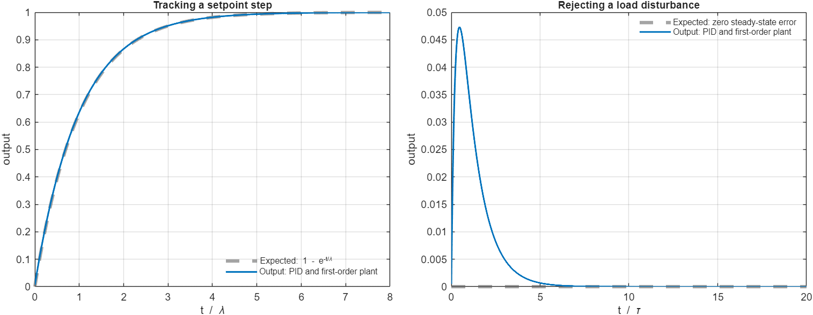

**What it validates.** The discrete PID controller used on valves, pumps and the burner.

**Reference.** The IMC (lambda) tuning rule of Åström and Hägglund [39](../docs/references.md#r39),
which makes the closed loop an exact first-order response.

**Expected output.** Tuned for a first-order plant, the closed loop follows $1 - e^{-t/\lambda}$
after a setpoint step. The steady-state error is zero for a setpoint step and for a constant
load disturbance. After the output has saturated and the error changes sign, the controller
leaves the limit within one sample, which shows that the anti-windup works.

**Component output.** The response follows the ideal curve to 0.0067. Steady-state error is 4.2e-4 for the setpoint step and 2.1e-10 for the load disturbance. It leaves saturation on the first sample after the sign change.

### 3.2 LQR controller

`validate_lqr`

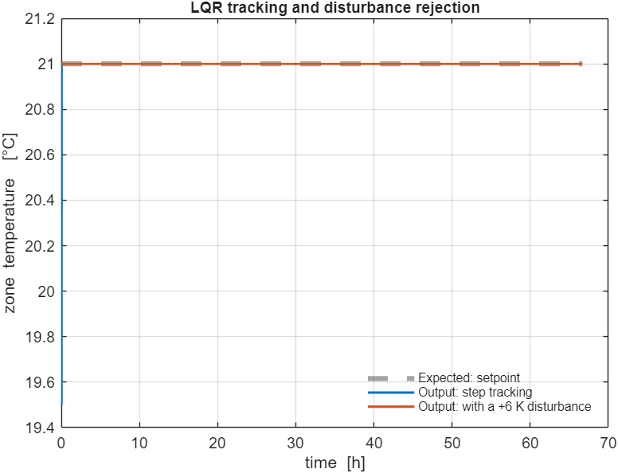

**What it validates.** The integral-augmented linear–quadratic regulator: its gain, the
stability of the closed loop, and its offset-free tracking.

**Reference.** Franklin, Powell and Emami-Naeini [41](../docs/references.md#r41), and
Anderson and Moore [42](../docs/references.md#r42).

**Expected output.** The gain equals the one an independent `dlqr` call gives for the same
weights. With the integral weight reduced to zero, it approaches the gain of a plain LQR.
As the sample time shrinks, it approaches the analytic continuous-time gain of a double
integrator. All closed-loop poles lie inside the unit circle. The loop tracks a setpoint and
rejects a constant disturbance without offset.

**Component output.** The gain equals the independent calculation exactly. Distance to the plain-LQR gain is 9.8e-6, and to the continuous-time gain 2.2e-3. All poles are stable.
Tracking and disturbance errors are 3e-13.

---

## 4. Plant and boundary conditions

### 4.1 Central heat plant

`validate_plant_dynamics`

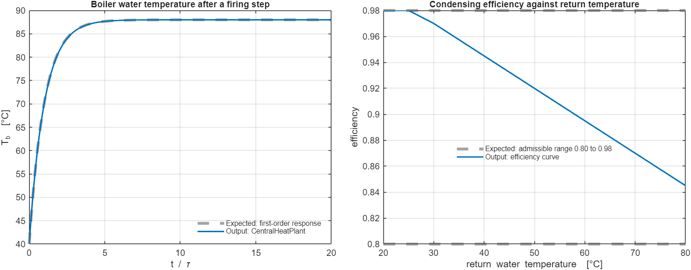

**What it validates.** The plant's water-temperature dynamics, its energy balance, its
high-limit safety cutout and its condensing-boiler efficiency curve.

**Reference.** ASHRAE *Handbook: HVAC Systems and Equipment* [32](../docs/references.md#r32) and AHRI
Standard 1500 [33](../docs/references.md#r33).

**Expected output.** After a step in firing, the boiler water follows a first-order response.
At steady state, the fuel input balances the heat carried to the network plus the fixed
losses. The cutout keeps the boiler water below its limit. The efficiency falls monotonically
as the return temperature rises and stays between 0.80 and 0.98.

**Component output.** The step response follows the first-order curve to 0.3 % of the step.
Steady-state balance closes to 3e-9. In every case the cutout holds, and the efficiency curve is monotonic and inside the range.

### 4.2 Solar irradiance

`validate_solar_poa`

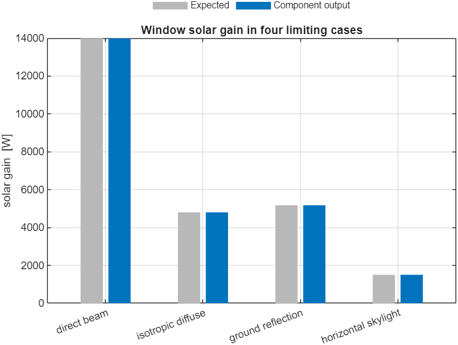

**What it validates.** The conversion of horizontal irradiance into the irradiance on a wall
or window of any orientation.

**Reference.** Duffie and Beckman [35](../docs/references.md#r35)
and the isotropic sky model of Liu and Jordan [36](../docs/references.md#r36).

**Expected output.** Simple geometry gives exact answers in limiting cases: direct beam from
a low southern sun scales with the sine of the zenith angle; diffuse sky irradiance on a
vertical wall is half the horizontal diffuse value; ground reflection is the ground
reflectance times half the global irradiance; a horizontal surface receives the horizontal
irradiance; and the gain at night is zero.

**Component output.** The four gains are 13,992 W, 4,800 W, 5,175 W and 1,500 W, each equal
to its formula to 4e-10 or better. Night gain is zero, a south window receives more
than five times the gain of a north window under a low southern sun, and the air and mass
split equals the specified fraction.

### 4.3 Occupancy and setpoint schedule

`validate_schedule`

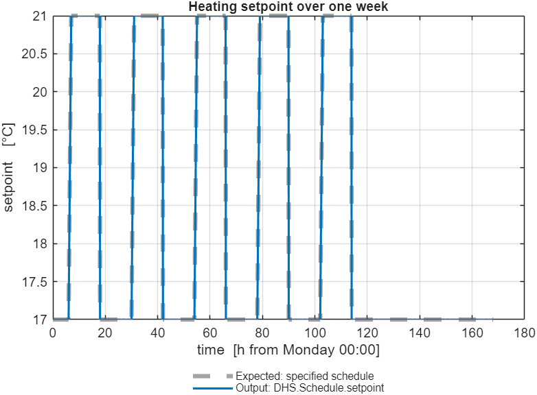

**What it validates.** The occupancy, setpoint and internal-gain schedule, including the
optimal-start ramp.

**Reference.** The specified rules, taken from ASHRAE Standard 90.1-2022 Appendix G [8](../docs/references.md#r8), the
National Energy Code of Canada for Buildings (2020) [9](../docs/references.md#r9) and CIBSE Guide H, Section 3 [11](../docs/references.md#r11).

**Expected output.** Occupied hours, the weekend override and the occupied and setback
setpoints follow the specification exactly. The ramp before occupancy is linear with slope
$(T_\text{occ} - T_\text{sb})/t_\text{ramp}$ and arrives at the occupied setpoint at the start of
occupancy.

**Component output.** Every rule is reproduced exactly. Ramp slope is 4 °C/h, linear to
4e-15, and the setpoint is within 4e-7 °C of the occupied value at the start of occupancy.

---

## 5. Full system

### 5.1 Building in a closed-loop system

`validate_desBuilding`

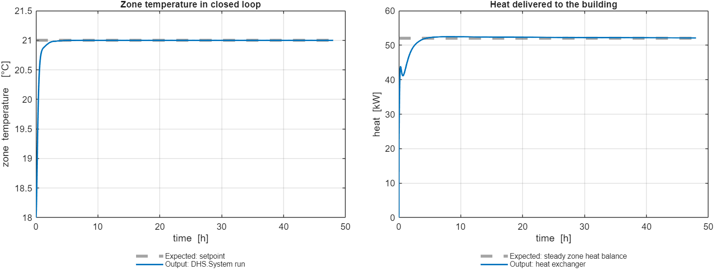

**What it validates.** A `DHS.Building` inside a complete district heating system (plant,
pipes, valve and substation), run for 48 hours (about ten time constants) from a Monday start with constant weather, for a single zone and for several zones.

**Reference.** The steady-state zone heat balance (ASHRAE *Handbook: Fundamentals*
[7](../docs/references.md#r7)): delivered heat plus internal gain equals the loss through the
envelope and ventilation.

**Expected output.** At equilibrium the zone temperature is at its setpoint and the delivered heat equals the steady zone heat balance, $(UA + G_	ext{vent})(T_	ext{set} - T_	ext{out}) - Q_	ext{int}$, which is 52 kW for the test building. The valve is at a partial opening, neither shut nor fully open, so it has authority to regulate. For a
multi-zone building the heat split conserves the total delivered energy, and no zone
receives negative heat. The figure shows the 48-hour run: the zone reaches its setpoint within about three hours and the delivered heat settles at the expected 52 kW.

**Component output.** The heat-balance residual is 1.2e-3 (relative) and the zone temperature is within 4e-5 °C of the setpoint. At equilibrium the valve rests at 69 % travel. Multi-zone splitting conserves energy to 1e-16 with no negative heat delivery, and `exchange()` agrees with the
standalone `heatExchanger()` function exactly.

---

## References

The numbered sources cited above are listed, with DOIs and links, in [`docs/references.md`](../docs/references.md).
